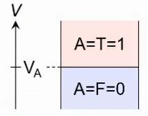
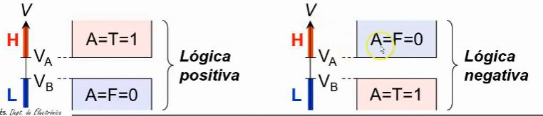
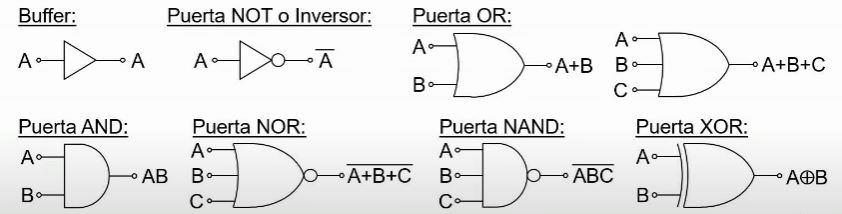
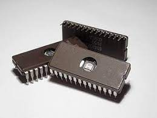
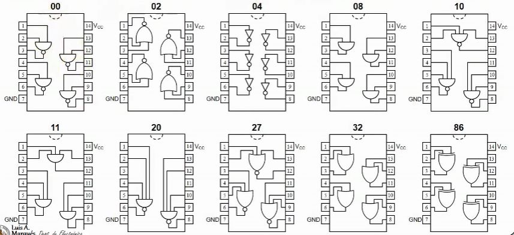

# TEMA 2: CIRCUITOS COMBINACIONALES A NIVEL DE PUERTAS

## 2.1 Principios de lógica combinacional. Análisis y diseño de circuitos combinacionales.

## VARIABLES LÓGICAS EN ELECTRÓNICA DIGITAL

En los circuitos electrónicos digitales se utiliza la tensión eléctrica para representar las variables lógicas.

Se puede definir una variable lógica A utilizando la tensión eléctrica V eligiendo un valor concreto de tensión, Va, y considerando que:

```txt
Si V >= Va ==> A = T = 1
Si V < Va ==> A = F = 0
```



En la práctica es complicado mantener la tensión en un valor fijo. Por ello, y para evitar problemas debidos a la superposición de ruido, para definir una variable lógica se utilizan dos tensiones concretas distintas, Va y Vb. La mayor de ellas define el nivel de tensión de alta (H) y la menor el nivel de tensión de baja (L):




## PUERTAS LÓGICAS

Son los circuitos electrónicos que implementan funciones lógicas elementales. Dependiendo del tipo de dispositivo qeu se emplee (diodos, transistores bipolares, transistores MOS) se tiene una determinada familia lógica.

Independientemente de qué familia lógica se utilice, las puertas lógicas se representan mediante una serie de símbolos estandar.

  

Los circuitos digitales se suelen fabricar integrados en chips de silicio. Se clasifican según sea la escala de integración (Scale Integration, SI):

  

- SSI (Small SI): < 12 puertas.
- MSI (Medium SI): 12 - 99 puertas.
- LSI (Large SI): 100 - 9.999 puertas.
- VLSI (Very Large SI): 10.000 - 99.999 puertas.
- ULSI (Ultra Large SI): 100.000 - 999.999 puertas.
- GSI (Giga SI): de 1.000.000 o más puertas.

## CIRCUITOS INTEGRADOS DE PUERTAS LÓGICAS

Se trata de circuitos de escala de integración pequeña SSI. Cada uno de ellos se identifica por un número que indica el orden dentro del catálogo de circuitos integrados.

Ejemplos:

  


## 2.2 Fenómenos aleatorios en circuitos combinacionales.

cotinuará